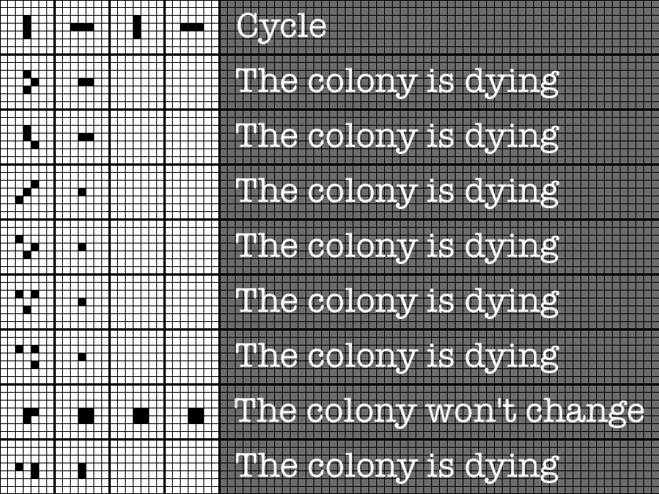

# Conway's Game of Life

Implementation of the game ‘Life’ - a cellular automaton invented by English mathematician John Conway. A graphical interface and the ability to control the game with buttons is implemented. The player does not actively participate in the game. He only arranges or generates the initial configuration of ‘living’ cells, which are then changed according to the rules. Cells are coloured black if they are alive and white if they are dead. The grid lines are drawn in grey.

The game stops if:

* there are no live cells left on the field;
* the configuration on the next step exactly (without shifts and turns) repeats itself on one of the earlier steps (a periodic configuration is formed).
* at the next step none of the cells changes its state (a special case of the previous rule, a stable configuration is formed).
